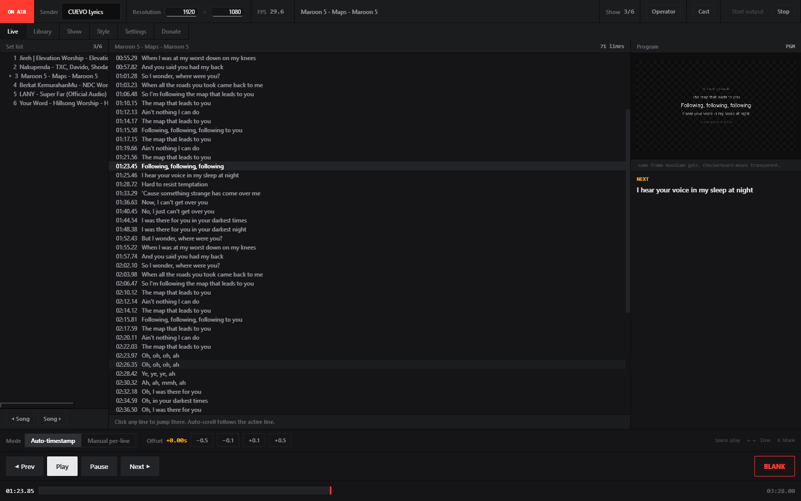
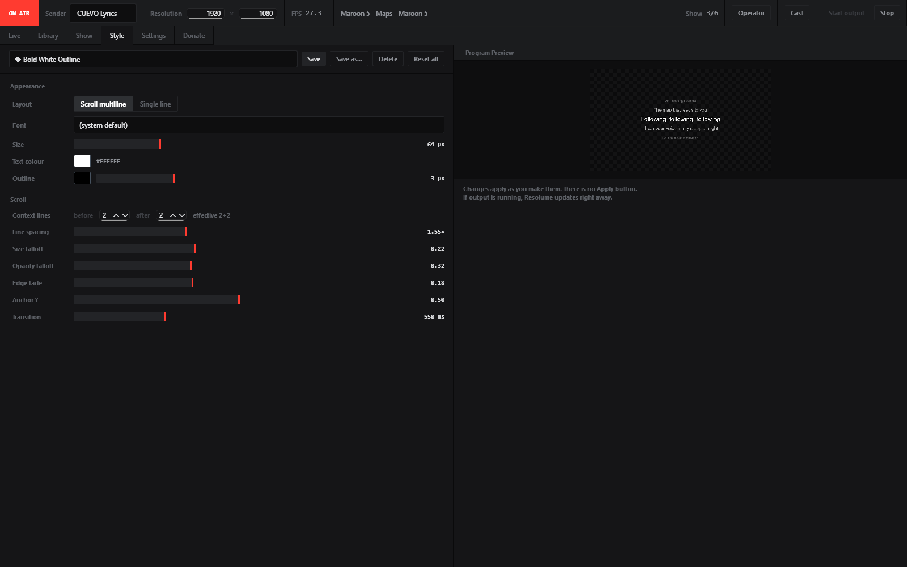
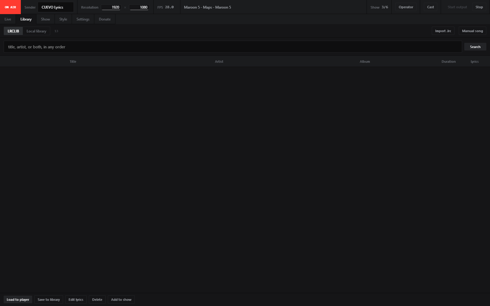
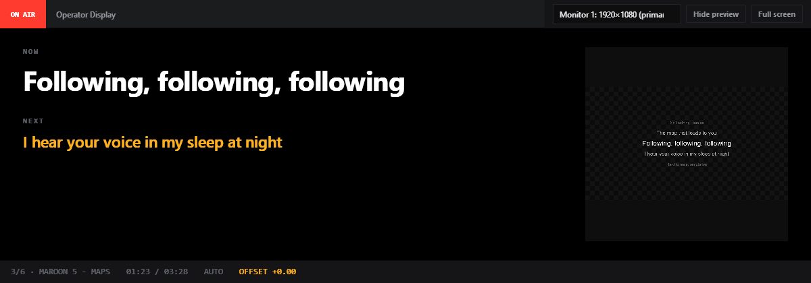
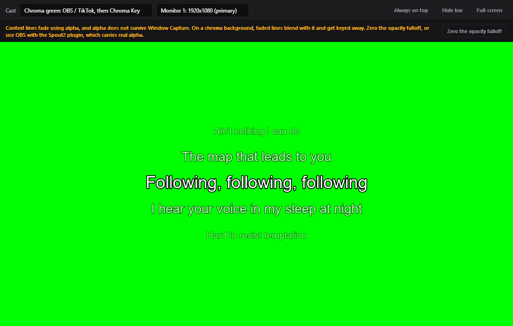

# CUEVO Lyrics

Send time-synced song lyrics straight into Resolume Arena over **Spout**.

Search lyrics on [LRCLIB](https://lrclib.net) or type them yourself, build a
set list, style the output, and run the whole thing from one window while the
show is live.

[](LICENSE)


```
[LRCLIB search / local library / manual editor]  ->  [LRC parser: lines + timestamps]
    ->  [Show: order the songs]                  ->  [Live: play, pause, next, blank]
    ->  [multi-line scroll render, transparent RGBA]
    ->  [SpoutGL]  ->  [Resolume Arena: Sources > Spout]
```



*The Live tab during a show. Set list on the left, the full lyric sheet in the
middle, and on the right a preview of the exact frame Resolume is receiving.
The strip reads ON AIR at 29.7 fps, which is measured rather than decorative.*

## Download

Grab the latest build from the [Releases page](https://github.com/mochaheree/cuevo-lyrics/releases).
Unzip it anywhere and run `CUEVO Lyrics.exe`. No installer, and nothing is
written outside your user folder.

Windows may show a SmartScreen warning the first time, because the build is
not code signed. Click **More info**, then **Run anyway**. If you would rather
not trust a binary from a stranger, run it from source instead. That is the
whole point of it being open.

## What it does

**Timing is manual, on purpose.** You press Play when the song starts, and
nudge it with the offset buttons (`-0.5s` / `-0.1s` / `+0.1s` / `+0.5s`) if the
lyrics drift. There is no audio listening and no beat detection. For songs
with no steady tempo, acapella or rubato, there is a **manual line mode**:
lines only move when you press Next or Prev, and the clock is ignored
entirely.

**The output looks like a lyrics app, not a text box.** Multi-line scroll in
the style of Musixmatch: the active line stands out, the lines around it
shrink and fade, and everything glides between positions. Or single line mode
if you want a lower third. Both are set in the Style tab, no code editing.

**It keeps working offline.** Once a song is in your local library, LRCLIB
being unreachable does not stop the show.

## Requirements

- **Windows** for Spout output. Spout is a Windows-only GPU texture sharing
  technology. On other systems the app still opens and you can search, edit
  and organise lyrics, but the "Start output" button stays disabled.
- Python 3.9 or newer, 64-bit, if you run from source.
- Any Resolume Arena version with a Spout receiver.

## Running from source

```powershell
pip install -r requirements.txt
python main.py
```

If `SpoutGL` fails to install, it is almost always a 32-bit Python trying to
install a 64-bit wheel. Use the official 64-bit build from python.org.

## Building the executable

```powershell
pip install pyinstaller
pyinstaller --noconfirm "CUEVO Lyrics.spec"
```

The result lands in `dist/CUEVO Lyrics/`. The spec copies the whole `assets/`
folder into the build, which is where the app icon and the donation QR live.

## Connecting to Resolume Arena

1. Press **Start output** in CUEVO Lyrics. The status strip switches from
   **IDLE** to **ON AIR**.
2. In Resolume, right-click a layer, a clip, or an empty slot.
3. Pick **Sources > Spout**.
4. Choose the sender name shown in the Settings tab. The default is
   `CUEVO Lyrics`.

The lyrics arrive as a clip with a transparent background, so you can stack
them over whatever else your set is running.

## The tabs

**Live** is where you spend the show. Set list on the left, the loaded song's
lines in the middle (click any line to jump to it), and on the right a preview
of exactly what Resolume is receiving. Transport sits along the bottom: play,
pause, next, prev, sync offset, the Auto/Manual switch, and **BLANK**, a kill
switch that empties the output without losing your place in the song.

Shortcuts: `Space` play/pause, `Left`/`Right` for previous and next line,
`B` for blank.

**Library** searches LRCLIB through a single free-form box. Title, artist, or
both, in any order. It also holds your saved songs, imports `.lrc` files,
opens the manual lyric editor, and adds songs to the show you have open.

**Show** builds the set list. Add from the library, drag to reorder, save to a
`.showproject.json` file, reopen it later. Song navigation during a show
happens in the Live tab rather than here, so you cannot knock the running
order out of place mid-set.

**Style** controls everything visual: layout, font from your system fonts,
size, text and outline colour, line spacing, size and opacity falloff, edge
fade, transition speed, and how many context lines to show. Changes are live
as you make them, including while output is running. Save what you like as a
Template, or start from one of the five presets. **Right-click any control to
reset it to its default**, the same way Resolume Arena behaves. Controls you
have changed get a dot next to their label.

**Settings** covers the Spout sender name, output resolution and fps, where
your library and shows live, and the shortcut list. It saves as soon as you
leave a field.

**Donate** has the Saweria link, a QRIS code, and contact links.

### Screenshots

| | |
|---|---|
|  |  |
| **Style.** Every visual parameter, live as you drag. | **Library.** One search box for title, artist, or both. |
|  |  |
| **Operator Display.** NOW and NEXT for a second monitor. | **Cast.** Chroma green for OBS and TikTok, with the alpha warning showing. |

## Casting to OBS, TikTok Live, or a second screen

The **Cast** button in the status strip opens a separate output window. One
window covers all three cases, because all three want the same thing:
something capturable.

| Goal | How |
|---|---|
| **OBS, best quality** | Install the Spout2 plugin for OBS, add a Spout source, pick the `CUEVO Lyrics` sender. Real alpha comes through, no chroma key needed. The Cast window is not involved. |
| **OBS, no plugin** | Cast window, **Chroma green** background, then Window Capture plus a Chroma Key filter in OBS. |
| **TikTok Live Studio** | Cast window, **Chroma green** or **Magenta**, then Screen or Window Capture. TikTok Live Studio does not know about Spout. |
| **Second screen or projector** | Cast window, **Black** background, pick the monitor, go full screen. |

**Hide bar** strips the window frame so the capture stays clean. While it is
hidden: right-click for the menu, drag to move the window, `Esc` to bring the
bar back.

> **Read this before chroma keying.** Context lines fade using alpha, and
> alpha does not survive Window Capture, because Windows composites the window
> over an opaque background first. The faded lines end up tinted with your
> background colour and get keyed away along with it. The app detects this and
> offers a **Zero out opacity falloff** button that fixes it. The line
> hierarchy still reads through size falloff alone. None of this applies if
> you use the Spout2 plugin in OBS.

## Project layout

```
main.py                  entry point
app.py                   QMainWindow: status strip and tabs

# core, no GUI and no Spout, runs anywhere
lrclib_client.py         HTTP calls to the LRCLIB API
lrc_parser.py            parse and format LRC, find the active line
player_state.py          play/pause/position/offset/blank, thread safe
render_style.py          RenderStyle, every visual parameter, scalable
scroll_anim.py           ScrollAnimator, scroll position state machine
show_session.py          ShowSession, the show currently on air

# render and output
spout_output.py          MultiLineLyricRenderer and SpoutOutputThread
font_catalog.py          system fonts mapped to paths Pillow can actually load

store/                   persistence, all under %APPDATA%\CUEVO Lyrics\
  paths.py                 file locations, atomic JSON writes, legacy migration
  library.py               Song CRUD
  shows.py                 Show CRUD, one file per show
  templates.py             Template CRUD plus five built-in presets
  settings.py              per-installation settings

ui/                      PySide6, roughly one file per tab
  theme.py                 design tokens to QSS, theme.paint() helper
  preview.py               preview widget, same frames Spout sends
  live_view.py / library_view.py / show_view.py / style_view.py / settings_view.py
  lyric_editor.py          tap-to-timestamp editor
  operator_view.py         NOW/NEXT window for a second monitor
  cast_window.py           capture window for OBS, TikTok, second screen
  donate_view.py           donation tab, all values in one block at the top

design/                  source artwork, deliberately not bundled into the exe
```

Dependencies run one way: `ui/` uses `store/`, `store/` uses the core. Core
modules and `store/` are not allowed to import `PySide6` or `SpoutGL`, which
is what keeps them testable without a display.

## Forking this

Two things are mine and should not stay in your fork:

1. The config block at the top of `ui/donate_view.py`. Saweria URL, QRIS
   details, contact links. It is all in one place at the top of the file
   precisely so you can replace it in seconds. Money landing in a stranger's
   account because you missed a constant is an expensive kind of bug.
2. `assets/qris.png`. Replace it with your own QR. Put the QR code itself in
   there, not a full QRIS poster: a poster scaled down leaves the actual code
   far too small to scan. Large QRIS codes need roughly 4 screen pixels per
   module to stay readable, which is why the one in this app is displayed at
   516px and never scaled.

The app icon lives at `assets/app-icon.ico`, built from the artwork in
`design/` and containing every size from 16 up to 256.

## Where your data lives

Everything is under `%APPDATA%\CUEVO Lyrics\`. Nothing is written into the
program folder, and nothing leaves your machine except LRCLIB searches.

The app used to be called **Lyric Spout**. If you have old data in
`%APPDATA%\LyricSpout\`, it gets moved across once, automatically, the first
time you run this version. Saved libraries and shows survive.

## Troubleshooting

**"SpoutGL/pygame not installed"** means the optional Windows packages are
missing. Rerun `pip install -r requirements.txt` on 64-bit Windows.

**Resolume cannot see the sender.** Check that you pressed Start output, so
the status strip reads **ON AIR** rather than **IDLE**, and that the small
pygame window is still open. Minimising it is fine, closing it is not.

**Lyrics not found on LRCLIB.** Drop the extras like "(Official Video)". The
search box takes title and artist together in any order, so there is no need
to split them up.

**Frame rate drops during animation.** Avoid effective font sizes below about
22px. There is a performance cliff in Pillow and FreeType right around there,
and the Style panel warns you when a setting is about to cross it.

## Known limitations

- OSC and MIDI remote control are built but have not been tested against real
  hardware yet. See SRS section 3.13 for exactly what is unverified.
- No audio analysis. Sync is manual by design.
- Spout output is Windows only.

## Slides

There is a deck covering the same ground in [docs/](docs/), as both
`CUEVO Lyrics.pdf` and an editable `CUEVO Lyrics.pptx`.

## Licence

MIT, see [LICENSE](LICENSE).

Lyrics come from [LRCLIB](https://lrclib.net), which is community
contributed. This project does not host, redistribute, or claim any rights to
lyrics. Check the licensing of any lyrics you put on a screen in front of a
paying audience.

## Credits

Built by [Gevan](https://github.com/mochaheree). Spout sharing through
[SpoutGL](https://github.com/jlai/Python-SpoutGL), lyrics through
[LRCLIB](https://lrclib.net), UI on [PySide6](https://doc.qt.io/qtforpython/).

The full design history, every bug that was found and how it was found, and
the measurements behind the decisions are in [SRS.md](SRS.md). It is written
in Indonesian and it is long, but it is the honest record rather than a
summary.
